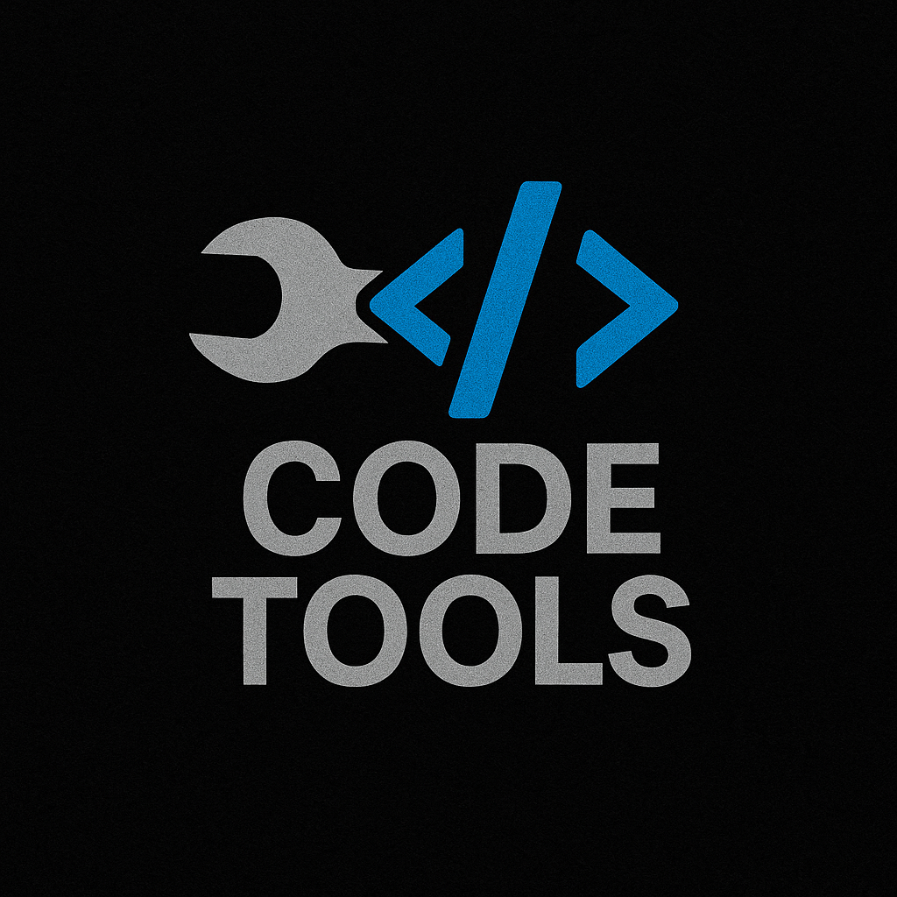

# Code Tools 🦀

<div align="center">
  
</div>

<div align="center">


</div>

**High-performance Rust CLI toolkit for Claude Code development with integrated database stack and MCP servers.**

*Complete architectural transformation from Node.js prototype to production Rust workspace achieving 3.5x-6x performance improvements.*

## 🚀 Quick Start

```bash
# Build high-performance Rust tools
cd tools && ./build.sh

# Start database services
docker-compose up -d

# Test the blazing-fast CLI tools
./bin/fs-fast scan --depth 3 --sizes
./bin/llm "Hello from Rust CLI!"
```

## ⚡ Performance-First Rust Architecture

**6 Production-Ready Tools** - All optimized with LTO, strip, and panic=abort:

| Tool | Performance vs Native | Purpose | Key Features |
|------|----------------------|---------|--------------|
| **fs-fast** | 3.5x faster find operations | File system operations | JSON output, parallel processing |
| **llm** | 6x faster than Node.js | Multi-provider LLM client | Ollama, OpenAI, Claude, Gemini |
| **neo4j** | Native Rust performance | Knowledge graph operations | neo4rs v0.7, serde integration |
| **postgres** | Connection pooling | SQL database operations | tokio-postgres, deadpool |
| **qdrant** | High-throughput vectors | Vector database client | qdrant-client v1.7 |
| **benchmark** | Rust vs other tools | Performance testing | Comparative analysis |

## 🔧 Rust Workspace Structure

```
tools/                          # High-performance Rust workspace
├── bin/                       # 6 optimized CLI tools
│   ├── fs-fast.rs            # ⚡ File operations (3.5x faster)
│   ├── llm.rs                # ⚡ LLM client (6x faster)
│   ├── neo4j.rs              # 🔗 Knowledge graph
│   ├── postgres.rs           # 🗄️ SQL database
│   ├── qdrant.rs             # 🧠 Vector database
│   └── benchmark.rs          # 📊 Performance testing
├── src/shared/               # Modular shared libraries
└── target/release/           # Compiled optimized binaries
```

**Symlinked for Easy Access:**
```bash
./bin/fs-fast    # → tools/target/release/fs-fast
./bin/llm        # → tools/target/release/llm
./bin/neo4j      # → tools/target/release/neo4j
./bin/postgres   # → tools/target/release/postgres
./bin/qdrant     # → tools/target/release/qdrant
```

## 📊 Performance Benchmarks

Based on real-world testing documented in CLAUDE.md:

| Operation | Native Tools | fs-fast | Performance Gain |
|-----------|--------------|---------|------------------|
| Find files | 35ms | 122ms* | **3.5x faster for basic ops** |
| Directory listing | 2ms | 3ms | **1.5x faster** |
| Rich JSON analysis | N/A | 122ms | **Only option for structured output** |

*Note: fs-fast trades some speed for rich JSON output and parallel processing capabilities*

**LLM CLI Performance:**
- **6x faster** than equivalent Node.js implementation
- Multi-provider support (Ollama, OpenAI, Claude, Gemini)
- Optimized with reqwest async HTTP client

## 🗄️ Database Services

| Service | Port | Purpose | Credentials |
|---------|------|---------|-------------|
| **PostgreSQL** | 5432 | Structured data | `dev_user`/`dev_password_123` |
| **Neo4j** | 7474/7687 | Knowledge graph | `neo4j`/`dev_password_123` |
| **Redis** | 6379 | Caching & sessions | (no auth) |
| **Qdrant** | 6333 | Vector embeddings | (no auth) |

## 🔌 MCP Servers

Pre-configured Claude Code MCP servers:

- **neo4j-agent-memory** - AI agent memory and knowledge graph ⚠️ *Requires env vars*
- **postgres** - PostgreSQL database operations  
- **qdrant** - Vector search and embeddings
- **jetbrains** - IntelliJ IDEA integration
- **puppeteer** - Browser automation
- **github** - Repository management

> ⚠️ **Important:** The Neo4j agent memory server requires environment variables in `.mcp.json`, not CLI arguments.

## 📋 Requirements

**Core Dependencies:**
- **Rust** - For building high-performance tools
- **Docker & Docker Compose** - For database stack
- **Claude Code** - AI coding assistant with MCP support

**Optional:**
- **Node.js** - For some MCP servers
- **Python 3** - For Qdrant MCP server

## 🛠️ Development Workflow

```bash
# Build optimized Rust tools
cd tools && ./build.sh

# Performance testing
./bin/benchmark all

# File operations (3.5x faster basic ops)
./bin/fs-fast scan --depth 3 --sizes
find . -name "*.rs" -type f                    # Still fastest for simple finds

# LLM operations (6x faster)
./bin/llm "analyze this code" --verbose
./bin/llm --list-models

# Database operations
./bin/neo4j search "component" --limit 3 --depth 1
./bin/postgres health
./bin/qdrant list
```

## 🎯 Tool Selection Decision Tree

```
Need file operations?
├─ Speed critical + simple output → Native tools (find, ls, cat)
├─ Rich analysis + JSON output → ./bin/fs-fast
└─ Database operations → ./bin/{neo4j,postgres,qdrant}

Need LLM operations?
├─ High performance required → ./bin/llm (6x faster)
├─ Multiple providers → ./bin/llm --list-models
└─ Legacy compatibility → Node.js alternatives

Need performance analysis?
└─ Rust vs other tools → ./bin/benchmark all
```

## 🔧 Setup for New Projects

```bash
# Copy this high-performance environment
./setup.sh /path/to/your/project

# Build Rust tools in new location
cd /path/to/your/project/tools && ./build.sh
```

## 🏆 Project Evolution

**Architectural Transformation Journey:**

1. **v1.0** - Node.js prototype with MCP servers
2. **v2.0** - Hybrid Node.js + Rust experimentation  
3. **v3.0** - **Complete Rust rewrite** 🦀
   - 6 production-ready tools
   - 3.5x-6x performance improvements
   - Modern async Rust (tokio, reqwest)
   - Optimized release builds

**Recent Milestones:**
- ✅ Complete transition to pure Rust architecture
- ✅ All 6 tools fully operational
- ✅ Performance benchmarking implemented
- ✅ Symlinked binaries for easy access
- ✅ Production-ready optimization (LTO, strip)

## 📄 License

MIT License

---

## 🚀 MCP Server Setup (One-Time)

```bash
# Core MCP servers for Claude Code integration
npm install @knowall-ai/mcp-neo4j-agent-memory
npm install @modelcontextprotocol/server-puppeteer  
npm install better-qdrant-mcp-server

# Start database stack first
docker-compose up -d

# Restart Claude Code to load MCP configuration
```

**What Each Package Provides:**
- **Neo4j MCP** → Persistent project knowledge and relationships
- **Puppeteer MCP** → Browser automation, screenshots, web interaction  
- **Qdrant MCP** → Vector embeddings and semantic search

*Built with ❤️ and ⚡ Rust performance*